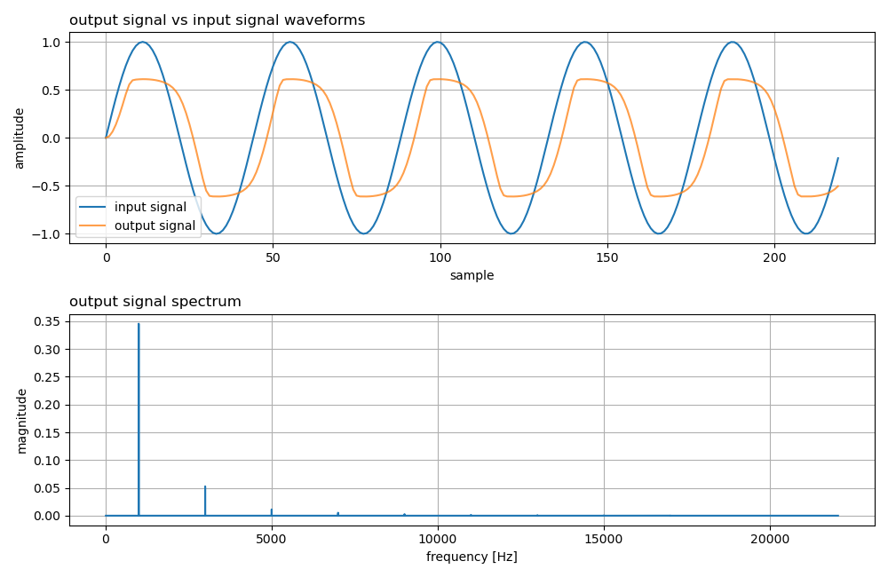
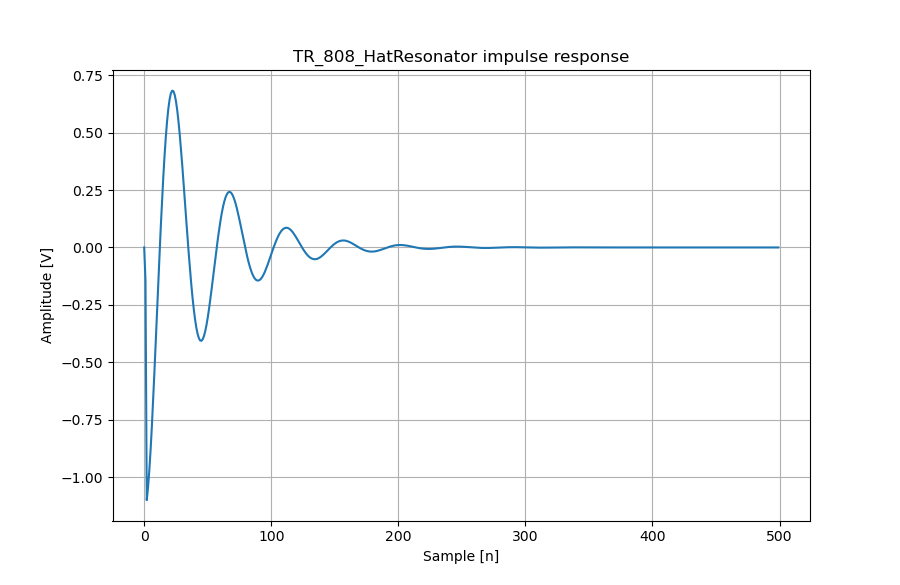

# pywdf
[**DAFX23 paper**](https://repositori.upf.edu/handle/10230/57903)

<code>pywdf</code> is a Python framework for modeling and simulating wave digital filter circuits. It allows users to easily create and analyze WDF circuit models in a high-level, object-oriented manner. The library includes a variety of built-in components, such as voltage sources, capacitors, diodes etc., as well as the ability to create custom components and circuits. Additionally, pywdf includes a variety of analysis tools, such as frequency response and transient analysis, to aid in the design and optimization of WDF circuits. Also included are several example circuits as shown below. 

## Installation
```
pip install git+https://github.com/gusanthon/pywdf
```

## Structure
The <code>core</code> directory contains the main source code of the repository. Basic WDF elements and adaptors are contained in <code>wdf.py</code>, adapted and unadapted R-Type adaptors are contained in <code>rtype.py</code>, and the circuit class and functionalities for examples are contained in <code>circuit.py</code>.
```
├── pywdf
│   ├── core
│   │   ├── circuit.py
│   │   ├── rtype.py
│   │   └── wdf.py
│   └── examples
│       ├── bassmantonestack.py
│       ├── baxandalleq.py
│       ├── diodeclipper.py
│       ├── lc_oscillator.py
│       ├── passivelpf.py
│       ├── rca_mk2_sef.py
│       ├── rclowpass.py
│       ├── sallenkeyfilter.py
│       ├── tr_808_hatresonator.py
│       └── voltagedivider.py
├── requirements.txt
├── setup.py
```

## Usage

```python
from pywdf import RCA_MK2_SEF, DiodeClipper, TR_808_HatResonator

# sweep positions of RCA mk2 SEF low pass filter knob and plot frequency responses
mk2_sef = RCA_MK2_SEF(44100, 0, 3000)
positions = range(1,11)
mk2_sef.plot_freqz_list(positions, mk2_sef.set_lowpass_knob_position, param_label = 'lpf knob pos')
```


```python
# analyze transient response of Diode Clipper to AC signal
dc = DiodeClipper(44100, cutoff= 1000, input_gain_db = 5)
dc.AC_transient_analysis()
```


```python
# visualize impulse response of TR-808 hat resonator
hr = TR_808_HatResonator(44100, 1000, .5)
hr.plot_impulse_response(outpath='pywdf/figures/hat_res_IR.png')
```



## Citation
If you use this library for WDF prototyping, please cite the [DAFx23 conference paper](https://repositori.upf.edu/handle/10230/57903) using the following reference:
```
Anthon G, Lizarraga-Seijas X, Font F. PYWDF: an open source library for prototyping and simulating wave filter circuits in Python. In: Fontana F, Willemsen S, editors. Proceedings of the 26th International Conference on Digital Audio Effects (DAFx-23); 2023 Sep 4-7; Copenhagen, Denmark. [Copenhagen]: [Aalborg University]; 2023. p. 335-341.
```

## For more information

Based on Jatin Chowdhury's C++ [WDF library](https://github.com/Chowdhury-DSP/chowdsp_wdf)  

Developed from work done in master thesis [Evaluating the Nonlinearities of A Diode Clipper Circuit Based on Wave Digital Filters](https://zenodo.org/record/7116075) 

For further reading, check out:

- Alfred Fettweis, "Wave Digital Filters: Theory and Practice", 1986, IEEE Invited Paper [[URL]](https://ieeexplore.ieee.org/stamp/stamp.jsp?arnumber=1457726)
- Kurt Werner, "Virtual Analog Modeling of Audio Circuitry Using Wave Digital Filters", PhD. Dissertation, Stanford University, 2016 [[URL]](https://stacks.stanford.edu/file/druid:jy057cz8322/KurtJamesWernerDissertation-augmented.pdf)  
- Giovanni De Sanctis and Augusto Sarti, “Virtual analog modeling in the wave-digital domain,” IEEE transactions on audio, speech, and language processing, vol. 18, no. 4, pp. 715–727, 2009. [[URL]](https://ieeexplore.ieee.org/abstract/document/5276845)
- Kurt James Werner, Vaibhav Nangia, Julius O Smith, and Jonathan S Abel, “A general and explicit formulation for wave digital filters with multiple/multiport nonlinearities and complicated topologies,” IEEE, 2015, pp. 1–5. [[URL]](https://ieeexplore.ieee.org/document/7336908)
- D. Franken, Jörg Ochs, and Karlheinz Ochs, “Generation of wave digital structures for networks containing multiport elements,” Circuits and Systems I: Regular Papers, IEEE Transactions on, vol. 52, pp. 586 – 596, 04 2005. [[URL]](https://www.researchgate.net/publication/4018571_Generation_of_wave_digital_structures_for_connection_networks_containing_ideal_transformers)


## Contributions
We welcome contributions to this project from anyone interested in helping out. If you notice a bug or would like to request a new feature, please open an Issue and we'll take a look as soon as possible.
